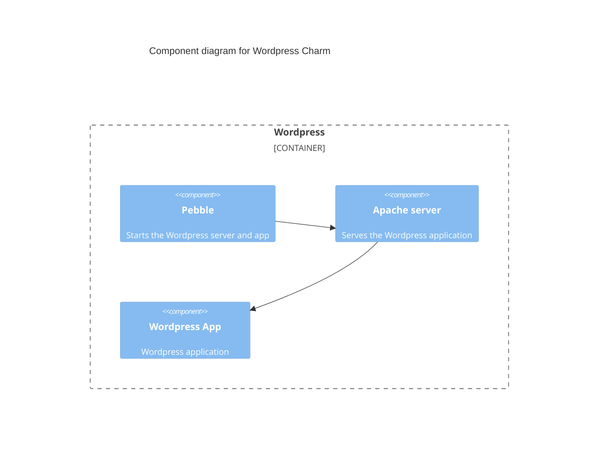

# Charm architecture

The wordpress-k8s charm aims to provide core functionalities of WordPress with horizontally
scalable architecture, leveraging its flexible capabilities enhanced by plugins. Operational
capabilities are enhanced through integration with the
Canonical Observability Stack ([COS](https://charmhub.io/topics/canonical-observability-stack/))
charms.

## Charm architecture diagram

## Containers

The core component of wordpress-k8s charm consists of a wordpress-k8s main workload container with an Apache Prometheus exporter. The services inside the container are driven by
Pebble, a lightweight API-driven process supervisor that controls the lifecycle of a service.
Learn more about Pebble and its layer configurations [in the Pebble documentation](https://github.com/canonical/pebble).

### wordpress

This container runs the main workload of the charm. The OCI image is custom built and includes
the WordPress CLI, Apache server and default WordPress plugins and themes. By
default, Apache server accepts all the web traffic on port 80 and redirects the requests to
WordPress PHP index file, handled by the default `x-httpd-php` handler. The configuration of the
Apache server redirects can be found in
[`wordpress_rock/files/etc/apache2`](https://github.com/canonical/wordpress-k8s-operator/blob/main/wordpress_rock/files/etc/apache2)
folder.

WordPress, by default, stores uploaded content files locally at `/wp-content/uploads` directory.
To make the content accessible across WordPress replication servers, a swift-proxy is added to
enable content storage on OpenStack Swift through the use of
[`wp_plugin_openstack-objectstorage_config` configuration parameter](https://charmhub.io/wordpress-k8s/configurations#wp_plugin_openstack-objectstorage_config). Swift proxy settings can be found
in [`docker-php-swift-proxy.conf`](https://github.com/canonical/wordpress-k8s-operator/blob/main/wordpress_rock/files/etc/apache2/conf-available/docker-php-swift-proxy.conf)
in the repository. The settings are dynamically modified during runtime when the
`wp_plugin_openstack-objectstorage_config` parameter is configured.

In order to enable monitoring of Apache server status, redirection to WordPress PHP for route
`/server-status` is overridden in
[`apache2.conf`](https://github.com/canonical/wordpress-k8s-operator/blob/main/wordpress_rock/files/etc/apache2/apache2.conf).
`/server-status` endpoint is accessed by `apache-exporter` service to convert and re-expose with
open metrics compliant format for integration with `prometheus_scrape` interface.

When a logging relation is joined, a promtail application is started via Pebble which starts
pushing Apache server logs to Loki. The configurations for Apache have been set up to stream logs
to both `access.log`, `error.log` files and container logs in
[`000-default.conf`](https://github.com/canonical/wordpress-k8s-operator/blob/main/wordpress_rock/files/etc/apache2/sites-available/000-default.conf).
These files are essential for promtail to read and push latest logs to Loki periodically.

### charm

This container is the main point of contact with the Juju controller. It communicates with Juju to
run necessary charm code defined by the main `src/charm.py`. The source code is copied to the
`/var/lib/juju/agents/unit-UNIT_NAME/charm` directory.

## OCI image

### wordpress-image

The wordpress-image is custom built to include a default set of plugins and themes. The list of
plugins and themes can be found at the reference section of the
[documentation](https://charmhub.io/wordpress-k8s/docs/reference-plugins). Since WordPress is
an application running on PHP, required libraries and dependencies are installed during the build
process.

WordPress application installation is done at runtime during database connection setup. This can
happen during database relation changed, database relation joined or database config changed
events.
To facilitate the WordPress installation process,
[WordPress CLI](https://make.wordpress.org/cli/handbook/guides/installing/) is embedded in the OCI
image during the build step. The latest CLI PHP archive file from source is used.

Currently, WordPress version 5.9.3 is used alongside Ubuntu 20.04 base image. The Ubuntu base image
hasn't yet been upgraded to 22.04 due to an unsupported PHP version 8 for
`wordpress-launchpad-integration` plugin (which currently supports PHP version 7). All other plugins and themes use
the latest stable version by default, downloaded from the source.

## Integrations

### Peer relations

When deploying multiple replications of the wordpress-k8s charm, peer relations are set up to
ensure synchronization of data among replications. Namely, secrets and admin credentials are shared
among peers. See more about the secrets in the `rotate-wordpress-secrets` action of the
[reference documentation](https://charmhub.io/wordpress-k8s/docs/reference-actions).

### database

The database relation is the standard database relation in accordance with the latest data platform
library. It is a required relation for wordpress-k8s charm to become active. It provides a
connection with `mysql_client` interface, meaning that any charms supporting MySQL client can
connect to the wordpress-k8s charm. It should be noted that the connection port on the database
side must be on 3306.

### ingress

Ingress interface provides external http/https access to the WordPress application along with other
additional capabilities depending on the ingress charm. The wordpress-k8s charm's ingress relation
is best enhanced with the [nginx-ingress-integrator](https://charmhub.io/nginx-ingress-integrator)
charm, providing additional capabilities such as ModSecurity enabled
Web Application Firewall ([WAF](https://docs.nginx.com/nginx-waf/)) through the wordpress-k8s charm
configuration parameter [`use_nginx_ingress_modsec`](https://charmhub.io/wordpress-k8s/configurations#use_nginx_ingress_modsec). The ingress relation interface is subject to
renaming due to additional ingress interface definition supported by the Traefik charm.

### metrics-endpoint

This interface is a part of the COS integration to enhance metrics observability. The wordpress-k8s
charm satisfies the `prometheus_scrape` interface as a provider by exposing Open Metrics compliant
`/metrics` endpoint. Requires [prometheus-k8s](https://charmhub.io/prometheus-k8s) charm. Learn
more about COS [here](https://charmhub.io/topics/canonical-observability-stack).

### logging

Logging relation is a part of the COS integration to enhance logging observability. The
wordpress-k8s charm satisfies the `loki_push_api` by integrating promtail that pushes Apache logs to
Loki. Requires the [loki-k8s](https://charmhub.io/loki-k8s) charm. Learn more about COS
[here](https://charmhub.io/topics/canonical-observability-stack).

### grafana-dashboard

Grafana-dashboard is a part of the COS integration to enhance observability. This relation provides
a pre-made dashboard used for monitoring Apache server hosting WordPress. The wordpress-k8s charm
satisfies the `grafana_dashboard` interface by providing the pre-made dashboard template to the
Grafana relation data bag under the "dashboards" key. Requires Prometheus datasource to be already
integrated with Grafana.

## Lifecycle events

Juju events allow progression of the charm in its lifecycle and encapsulates part of the execution
context of a charm. Below is the list of observed events for wordpress-k8s charm with how the charm
reacts to the event. For more information about the charm’s lifecycle in general, refer to the
charm’s life [documentation](https://juju.is/docs/sdk/a-charms-life#heading--the-graph).

### start

This event marks the charm’s state as started. The charm’s running state must be persisted by the
charm in its own state. See the documentation on the
[start event](https://juju.is/docs/sdk/start-event).

### uploads_storage_attached

This event marks the charm’s storage availability. The name of the event derived from the name of
the storage noted in the `metadata.yaml` configuration under "storage" key.
`containers.wordpress.mounts.storage` and `storage.uploads` section. The storage filesystem maps to
`/var/www/html/wp-content/uploads` directory of the WordPress application, which is used to store
uploaded content from the WordPress user.

### leader_elected

This event is fired when Juju elects a leader unit among the replica peers. The wordpress-k8s charm
then responds by setting up secrets and sharing them with peers through peer relation databag if
not already set.

### config-changed

The wordPress-k8s charm reacts to any configuration change and runs reconciliation between the current
state and the desired state. See the list of
[configurations](https://charmhub.io/wordpress-k8s/configure).

### wordpress_pebble_ready

When this event is fired, wordpress-k8s charm installs, configures and starts Apache server for
WordPress through Pebble if the storage is available. Configurations that are set dynamically
include database connection and secrets used by the WordPress application. Dynamic configurations
are modified in `wp-config.php` file and the changes are pushed through Pebble.

### apache_prometheus_exporter_pebble_ready

This event signals that the `apache_prometheus_exporter` container is ready in the pod. Apache
Prometheus exporter service is then started through Pebble.

### wordpress-replica_relation_changed

When any of the relation is changed, wordpress-k8s charm must run reconciliation between the
current state and the desired state with new relation data to synchronize the replication
instances. The reconciliation process is divided into 3 distinct steps: core, theme and plugin
reconciliation. Core reconciliation sets up the necessary WordPress application configuration:
secrets and database connection. Theme and Plugin respectively reconcile between currently
installed themes and plugins with the incoming list of themes and plugins.

### upgrade-charm

The `upgrade-charm` event is fired on the upgrade charm command `juju refresh wordpress-k8s`. The command sets up
secrets in peer-relation databag for upgraded deployment of WordPress if it was not already set.

## Charm code overview

The `src/charm.py` is the default entry point for a charm and has the WordpressCharm Python class which inherits from CharmBase.

CharmBase is the base class from which all Charms are formed, defined by [Ops](https://juju.is/docs/sdk/ops) (Python framework for developing charms).

> See more in the Juju docs: [Charm](https://canonical-juju.readthedocs-hosted.com/en/3.6/user/reference/charm/).

The `__init__` method guarantees that the charm observes all events relevant to its operation and handles them.

